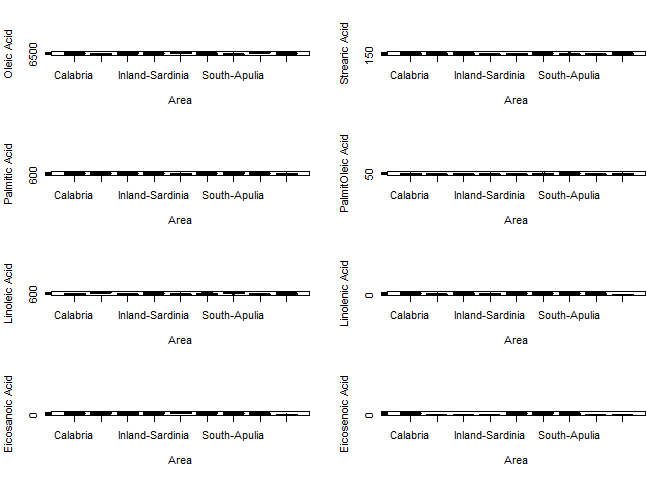
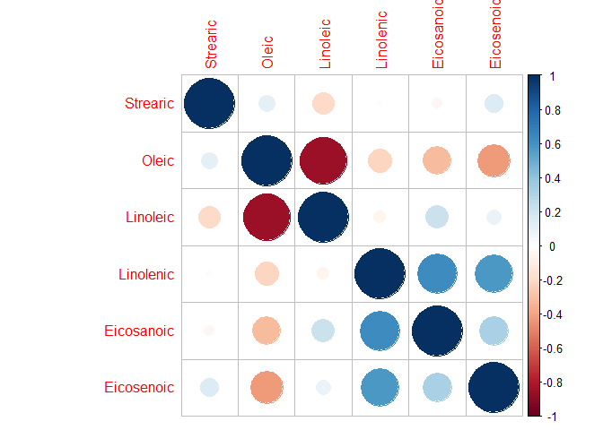

Basic\_Graphics
================

In this example we will using the Olives dataset and further explore the
data be using ggplot to help understand the data.

# Reading the Data set Olives and librarys

``` r
library(ggplot2)
library(corrplot)
```

    ## corrplot 0.84 loaded

``` r
Olives = read.csv('C:/Users/Bryce/Desktop/RStudio/DSCI 415/Olives.txt')
names(Olives)
```

    ##  [1] "Region.Name" "Area.Name"   "Palmitic"    "Palmitoleic" "Strearic"   
    ##  [6] "Oleic"       "Linoleic"    "Linolenic"   "Eicosanoic"  "Eicosenoic"

# 1D Plots

``` r
class(Olives$Palmitic)
```

    ## [1] "integer"

``` r
par(mfrow=c(3,3)) # sets a plotting region for with 3 rows and 2 columns
hist(Olives$Palmitic,xlab = "palmitic")
hist(Olives$Palmitoleic, xlab = "palmitoleic")
hist(Olives$Oleic, xlab = "oliec")
hist(Olives$Linoleic,xlab = "linoleic")
hist(Olives$Strearic,xlab="strearic")
hist(Olives$Linolenic,xlab = "linolenic")
hist(Olives$Eicosanoic,xlab = "eicosanoic")
hist(Olives$Eicosenoic,xlab = "eicosenoic")
```

<!-- -->

# 2D Plots by Area Name

The par(mfrow) code makes it so that it is 4 x 2 graphics.

``` r
par(mfrow=c(4,2))
ggplot(data = Olives, aes(x = Area.Name, y = Palmitic)) + geom_boxplot() + geom_jitter()
```

<!-- -->

``` r
ggplot(data = Olives, aes(x = Area.Name, y = Palmitoleic)) + geom_boxplot() + geom_jitter()
```

<!-- -->

``` r
ggplot(data = Olives, aes(x = Area.Name, y = Oleic)) + geom_boxplot() + geom_jitter()
```

<!-- -->

``` r
ggplot(data = Olives, aes(x = Area.Name, y = Linoleic)) + geom_boxplot() + geom_jitter()
```

<!-- -->

``` r
ggplot(data = Olives, aes(x = Area.Name, y = Strearic)) + geom_boxplot() + geom_jitter()
```

<!-- -->

``` r
ggplot(data = Olives, aes(x = Area.Name, y = Linolenic)) + geom_boxplot() + geom_jitter()
```

<!-- -->

``` r
ggplot(data = Olives, aes(x = Area.Name, y = Eicosanoic)) + geom_boxplot() + geom_jitter()
```

<!-- -->

``` r
ggplot(data = Olives, aes(x = Area.Name, y = Eicosenoic)) + geom_boxplot() + geom_jitter()
```

<!-- -->

# 3D Plots

``` r
ggplot(data = Olives, aes(x = Area.Name, y = Palmitic, color = Region.Name)) + geom_point() + geom_jitter()
```

<!-- -->

``` r
ggplot(data = Olives, aes(x = Area.Name, y = Palmitoleic, color = Region.Name)) + geom_point() + geom_jitter()
```

<!-- -->

``` r
ggplot(data = Olives, aes(x = Area.Name, y = Oleic, color = Region.Name)) + geom_point() + geom_jitter()
```

<!-- -->

``` r
ggplot(data = Olives, aes(x = Area.Name, y = Linoleic, color = Region.Name)) + geom_point() + geom_jitter()
```

<!-- -->

``` r
ggplot(data = Olives, aes(x = Area.Name, y = Strearic, color = Region.Name)) + geom_point() + geom_jitter()
```

<!-- -->

``` r
ggplot(data = Olives, aes(x = Area.Name, y = Linolenic, color = Region.Name)) + geom_point() + geom_jitter()
```

<!-- -->

``` r
ggplot(data = Olives, aes(x = Area.Name, y = Eicosanoic, color = Region.Name)) + geom_point() + geom_jitter()
```

<!-- -->

``` r
ggplot(data = Olives, aes(x = Area.Name, y = Eicosenoic, color = Region.Name)) + geom_point() + geom_jitter()
```

<!-- -->

# Boxplots by Region Names

``` r
par(mfrow=c(4,2)) # sets a plotting region for with 3 rows and 2 columns
boxplot(split(Olives$Oleic,Olives$Area.Name),xlab="Area",ylab="Oleic Acid")
boxplot(split(Olives$Strearic,Olives$Area.Name),xlab="Area",ylab="Strearic Acid")
boxplot(split(Olives$Palmitic,Olives$Area.Name),xlab="Area",ylab="Palmitic Acid")
boxplot(split(Olives$Palmitoleic,Olives$Area.Name),xlab="Area",ylab="PalmitOleic Acid")
boxplot(split(Olives$Linoleic,Olives$Area.Name),xlab="Area",ylab="Linoleic Acid")
boxplot(split(Olives$Linolenic,Olives$Area.Name),xlab="Area",ylab="Linolenic Acid")
boxplot(split(Olives$Eicosanoic,Olives$Area.Name),xlab="Area",ylab="Eicosanoic Acid")
boxplot(split(Olives$Eicosenoic,Olives$Area.Name),xlab="Area",ylab="Eicosenoic Acid")
```

<!-- -->

# Boxplots with Color

``` r
oleic.box = ggplot(Olives,aes(Area.Name,Oleic))
oleic.box + geom_boxplot(fill="blue") + xlab("Area Name") +
  ylab("Oleic Acid") + ggtitle("Oleic Acid vs. Growing Area")
```

<!-- -->

``` r
palmitic.box = ggplot(Olives,aes(Area.Name,Palmitic))
palmitic.box + geom_boxplot(fill="blue") + xlab("Area Name") +
  ylab("Oleic Acid") + ggtitle("Oleic Acid vs. Growing Area")
```

<!-- -->

# Finding Correlations

``` r
Olives.corr = cor(Olives[,-c(1:4)])   # find pairwise correlations between all variables.
options(digits=2)  # reduce the number of significant digits shown.
Olives.corr
```

    ##            Strearic Oleic Linoleic Linolenic Eicosanoic Eicosenoic
    ## Strearic      1.000  0.11   -0.198     0.019     -0.041      0.140
    ## Oleic         0.114  1.00   -0.850    -0.218     -0.320     -0.424
    ## Linoleic     -0.198 -0.85    1.000    -0.057      0.211      0.089
    ## Linolenic     0.019 -0.22   -0.057     1.000      0.620      0.578
    ## Eicosanoic   -0.041 -0.32    0.211     0.620      1.000      0.329
    ## Eicosenoic    0.140 -0.42    0.089     0.578      0.329      1.000

``` r
corrplot(Olives.corr)
```

<!-- -->

This was the basic introduction for ggplot using the Olives data set
