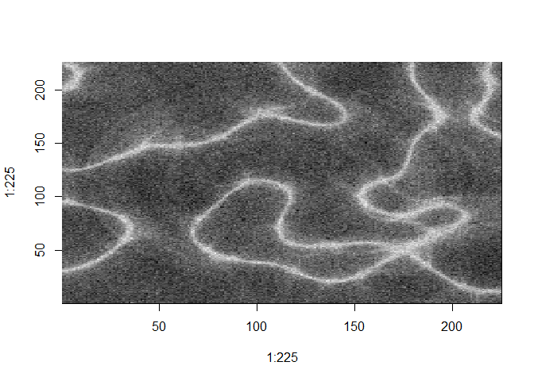
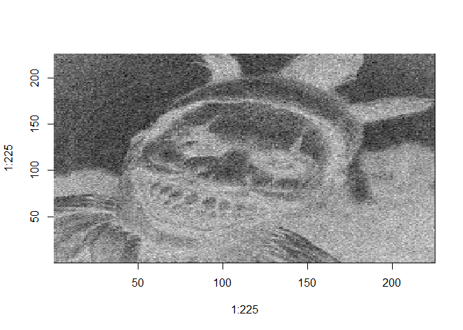
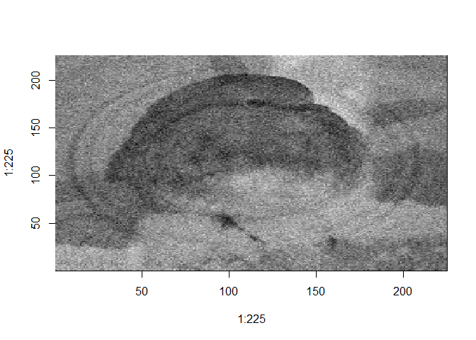
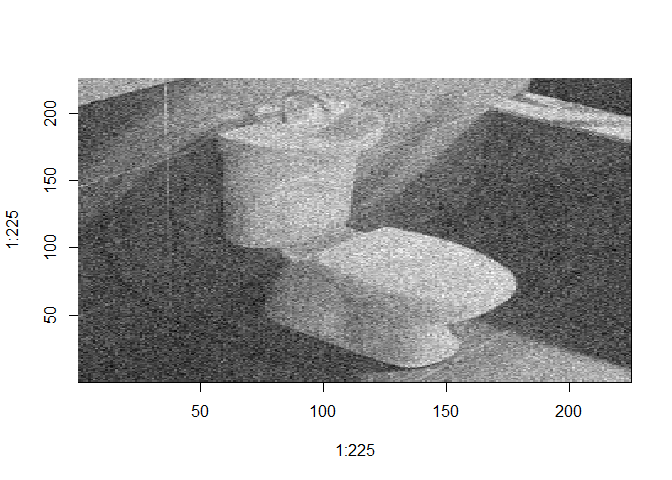
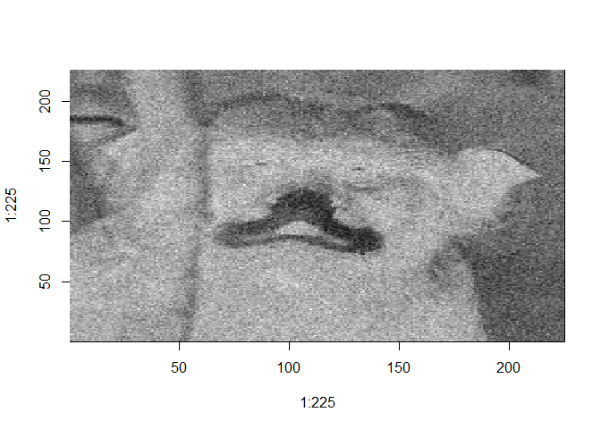

Images\_ICA
================

## Librarys

``` r
library(fastICA)
```

## Plotting orignal images

``` r
load('C:/Users/Bryce/Desktop/RStudio/DSCI 415/Tvimages.Rdata')
TV.plot = function(temp,i) {image(1:225,1:225,matrix(temp[,i],225,225),col=gray((0:225/225)))
}
 par(mfrow=c(4,4),mar=c(0,0,0,0),xaxt="n",yaxt="n")
 for (i in 1:16) {TV.plot(TVimages,i)}
```

<!-- -->

``` r
 reset_par()  # In FaceImages.RData that I sent you
 
 Results = fastICA(TVimages,n.comp=2)  

 attributes(Results)
```

    ## $names
    ## [1] "X" "K" "W" "A" "S"

## Plotting images with 5 comps

``` r
Results_5 = fastICA(TVimages,n.comp=5) 
image(1:225, 1:225, matrix(Results_5$S[,1],225,225),col=gray((0:225/225)))
```

<!-- -->

``` r
image(1:225, 1:225, 1-matrix(Results_5$S[,2],225,225),col=gray((0:225/225)))
```

<!-- -->

``` r
image(1:225, 1:225, matrix(Results_5$S[,3],225,225),col=gray((0:225/225)))
```

<!-- -->

``` r
image(1:225, 1:225, 1-matrix(Results_5$S[,4],225,225),col=gray((0:225/225)))
```

<!-- -->

``` r
image(1:225, 1:225, 1-matrix(Results_5$S[,5],225,225),col=gray((0:225/225)))
```

<!-- -->

# Plotting with 6 comps

``` r
Results_6 = fastICA(TVimages,n.comp=6) 
image(1:225, 1:225, 1-matrix(Results_6$S[,1],225,225),col=gray((0:225/225)))
```

<!-- -->

``` r
image(1:225, 1:225, matrix(Results_6$S[,2],225,225),col=gray((0:225/225)))
```

<!-- -->

``` r
image(1:225, 1:225, matrix(Results_6$S[,3],225,225),col=gray((0:225/225)))
```

<!-- -->

``` r
image(1:225, 1:225, matrix(Results_6$S[,4],225,225),col=gray((0:225/225)))
```

<!-- -->

``` r
image(1:225, 1:225, 1-matrix(Results_6$S[,5],225,225),col=gray((0:225/225)))
```

<!-- -->

``` r
image(1:225, 1:225, matrix(Results_6$S[,6],225,225),col=gray((0:225/225)))
```

<!-- -->

## Plotting with 8 Comps

``` r
Results_8 = fastICA(TVimages,n.comp=8) 
image(1:225, 1:225, matrix(Results_8$S[,1],225,225),col=gray((0:225/225)))
```

<!-- -->

``` r
image(1:225, 1:225, 1-matrix(Results_8$S[,2],225,225),col=gray((0:225/225)))
```

<!-- -->

``` r
image(1:225, 1:225, matrix(Results_8$S[,3],225,225),col=gray((0:225/225)))
```

<!-- -->

``` r
image(1:225, 1:225, 1-matrix(Results_8$S[,4],225,225),col=gray((0:225/225)))
```

<!-- -->

``` r
image(1:225, 1:225, 1-matrix(Results_8$S[,5],225,225),col=gray((0:225/225)))
```

<!-- -->

``` r
image(1:225, 1:225, matrix(Results_8$S[,6],225,225),col=gray((0:225/225)))
```

<!-- -->

``` r
image(1:225, 1:225, matrix(Results_8$S[,7],225,225),col=gray((0:225/225)))
```

<!-- -->

``` r
image(1:225, 1:225, 1-matrix(Results_8$S[,8],225,225),col=gray((0:225/225)))
```

<!-- -->

## Face plot function

``` r
face.plot = function(temp,i=1){
  temp = matrix(temp[,i],112,92)
  temp = apply(temp,2,rev)
  image(t(temp),col=gray((0:111)/111))
}
```

## Loading new data in

``` r
load('C:/Users/Bryce/Desktop/RStudio/DSCI 415/FaceAssign.Rdata')
```

## Plotting new data faces

``` r
par(mfrow=c(10,8),mar=c(0,0,0,0),xaxt="n",yaxt="n")
for (i in 1:80) {face.plot(OlivettiTrain,i)}
```

<!-- -->

``` r
reset_par()
```

## Finding mean and plotting

``` r
OTmean = apply(OlivettiTrain,1,mean)
face.plot(as.matrix(OTmean))       
```

<!-- -->

``` r
mean.mat = matrix(rep(OTmean,320),10304,320)
dim(mean.mat)
```

    ## [1] 10304   320

``` r
OT.mc = OlivettiTrain - mean.mat
```

## Doing SVD and storing U,V,D for later use

``` r
faces.svd = svd(OT.mc)
U <- faces.svd$u
V <- faces.svd$v
D <- diag(faces.svd$d)

dim(U)
```

    ## [1] 10304   320

``` r
dim(V)
```

    ## [1] 320 320

``` r
dim(D)
```

    ## [1] 320 320

## Approximating 30 to see if image is clear

``` r
Approx30 = U[,1:30]%*%D[1:30,1:30]%*%t(V[,1:30]) + mean.mat
par(mfrow=c(10,8),mar=c(0,0,0,0),xaxt="n",yaxt="n")
for (i in 1:80) {face.plot(Approx30,i)}
```

<!-- -->

## Trying to get petter pictures by using 40

``` r
Approx40 = U[,1:40]%*%D[1:40,1:40]%*%t(V[,1:40]) + mean.mat
par(mfrow=c(10,8),mar=c(0,0,0,0),xaxt="n",yaxt="n")
for (i in 1:80) {face.plot(Approx40,i)}
```

<!-- -->

## Picking Individual faces

``` r
face.plot(OlivettiTest,31)
```

<!-- -->

``` r
face.plot(OlivettiTest,32)
```

<!-- -->

## Finding mean again

``` r
mean.test.mat = matrix(rep(OTmean,80),10304,80)
OTest.mc = OlivettiTest - mean.test.mat
```

``` r
Vnew = t(U)%*%OTest.mc
dim(Vnew)
```

    ## [1] 320  80

``` r
Vnew22 = t(U[,1:22])%*%OTest.mc
dim(Vnew22)
```

    ## [1] 22 80

## Plotting indiviudal faces with aprox 22

``` r
face31.approx = U[,1:22]%*%matrix(Vnew22[,31],22,1) + OTmean
face.plot(face31.approx)
```

<!-- -->

``` r
face32.approx = U[,1:22]%*%matrix(Vnew22[,32],22,1) + OTmean
face.plot(face32.approx)
```

<!-- -->

## Function for weight distribution

``` r
weightdist = function(vnew,V,k=22) {
  d = rep(0,320)
  for (i in 1:320) {
    d[i]=sqrt(sum((vnew-t(V)[1:k,i])^2))
  }
  which.min(d)
}
```

## Plotting faces with weighted distribution

``` r
Vnew1 = Vnew22[,31] 
Vnew2 = Vnew22[,32] 

weightdist(Vnew22[,31],V)
```

    ## [1] 248

``` r
weightdist(Vnew22[,32],V)
```

    ## [1] 249

``` r
face.plot(OlivettiTrain,248)
```

<!-- -->

``` r
face.plot(OlivettiTrain,249)
```

<!-- -->
